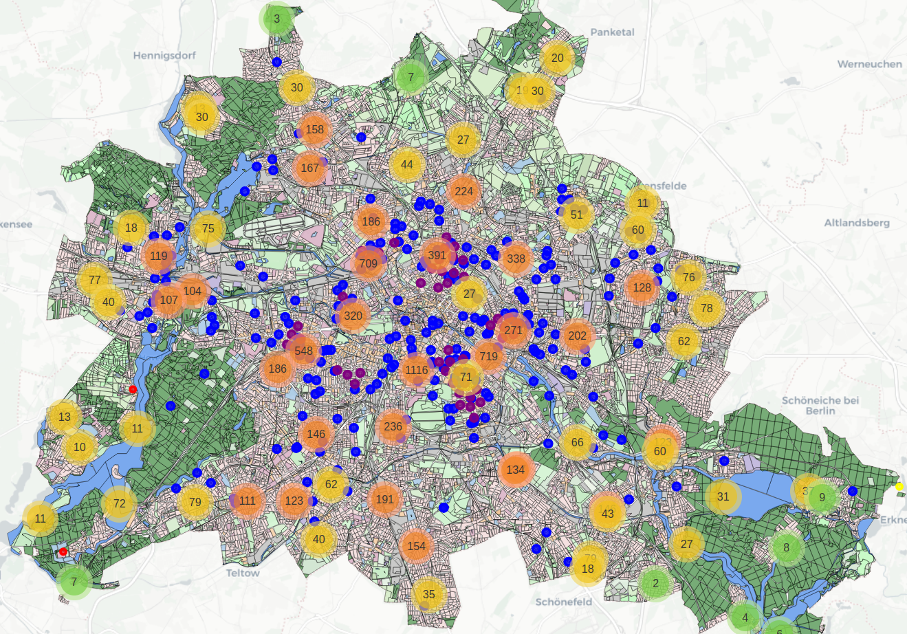
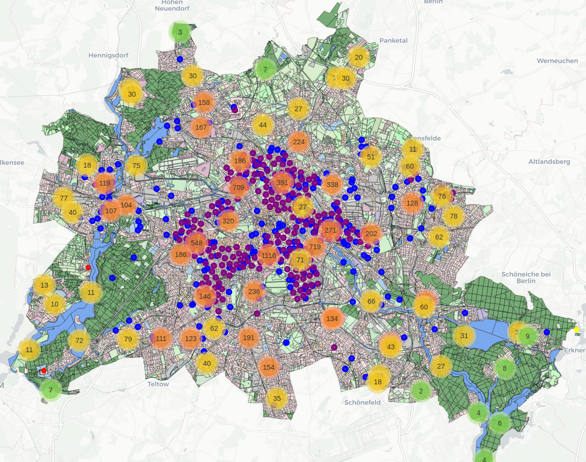
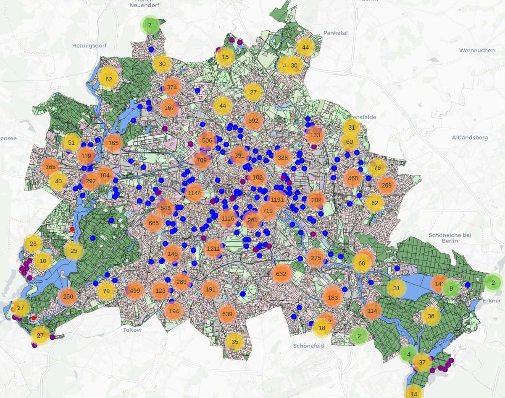
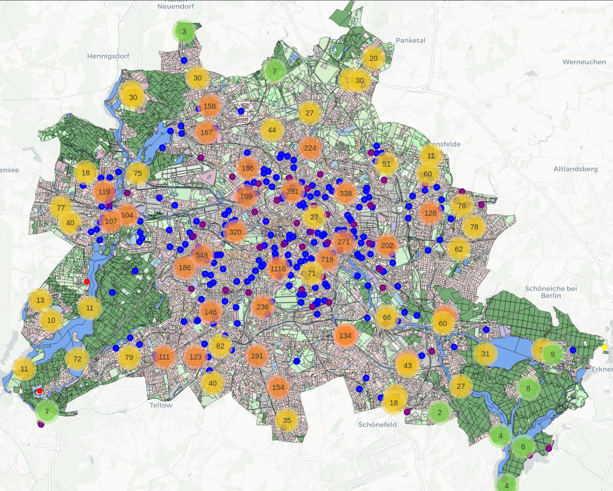
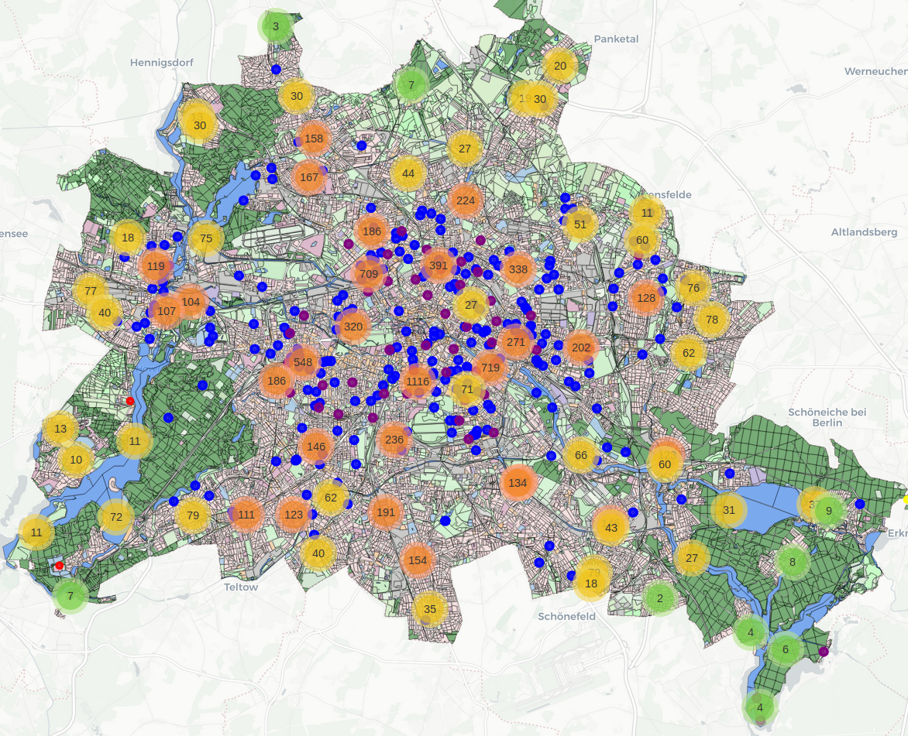
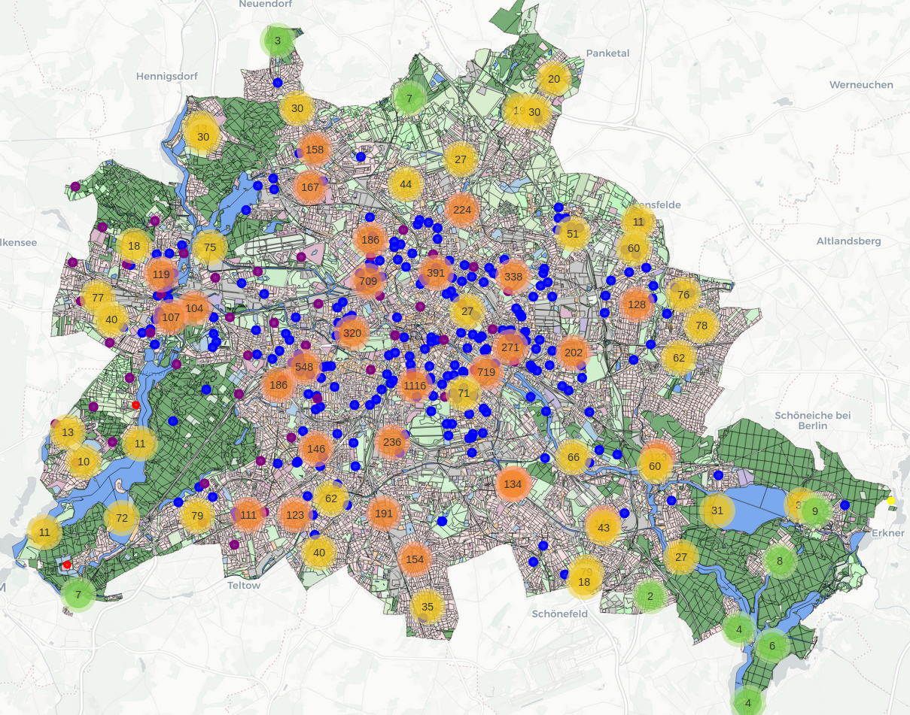
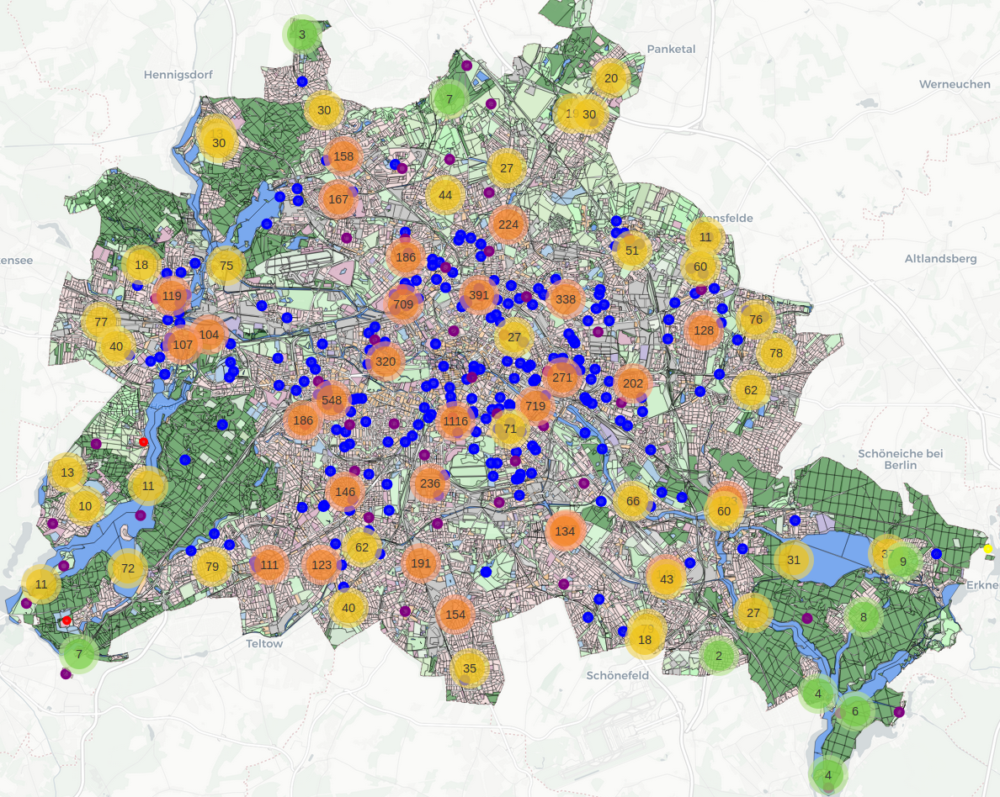
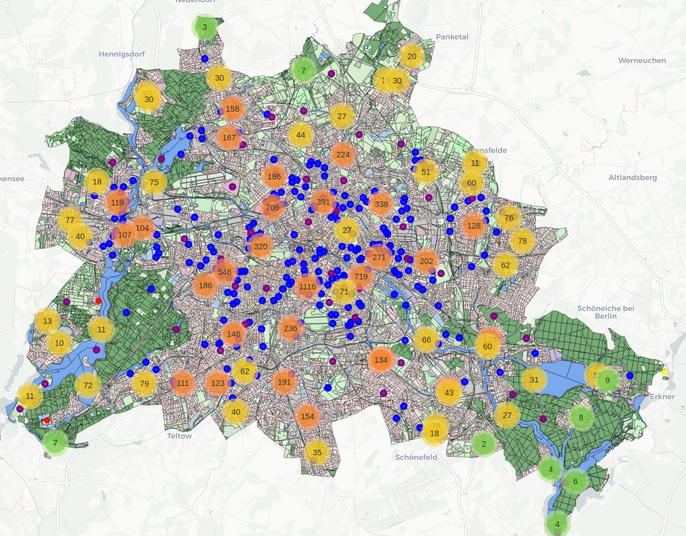

# Urban Technologies: A weighted linear combination to calculate locations for new drinking fountains in Berlin

## Project Overview

Berlin currently operates **242 public drinking fountains** that provide free access to drinking water across  
the city. These fountains are generally considered a **public amenity rather than critical infrastructure**,  
and they are **only operational between April and October**.

This project investigates the question:

**Where should additional drinking fountains be installed in Berlin?**

Using publicly available geospatial datasets, the project evaluates **suitable locations for 50 new drinking fountains**.  
The number **50** is only a default parameter and can easily be changed in the project scripts.

The analysis combines **five datasets** to identify areas where additional drinking fountains would likely provide the greatest benefit.  
These include:

* Existing drinking fountain locations
* Urban land use classifications
* Population density
* Public transport stops
* Beverage-providing retail stores

The goal is to identify **areas with high demand for drinking water but limited existing supply**.

---

# Project Workflow

The repository contains several scripts that guide the workflow of the project.

## 1. Inspecting the Datasets

Script: `01_checkout_datasets.py`

This script loads all datasets used in the project and prints:

* The **number of records**
* The **first rows (head)** of each dataset

This step serves as a **sanity check** to understand the structure of the datasets before analysis begins.

---

## 2. Calculating New Drinking Fountain Locations

Script: `02_calc_new_fountains_wlc.py`

The core of the project is implemented in this script.  
It uses a **Weighted Linear Combination (WLC)** approach to calculate a **suitability score for each spatial unit** in Berlin.

The algorithm iteratively places new drinking fountains in areas with the **highest calculated suitability score**  
and enforces a **minimum distance between newly placed fountains**.

### Parameters

```python
N_NEW_FOUNTAINS = 50     # number of new fountains to calculate
MIN_DISTANCE_NEW = 2000  # meters between newly created fountains
URBAN_RADIUS = 1000      # meters for urban population context
```

### Weights used in the scoring model

```python
weights = {
    "landuse": 0.50,
    "population": 0.10,
    "urban_pop": 0.90,
    "dist_fountain": 0.50,
    "dist_store": 0.15,
    "dist_stop": 0.10,
    "edge": 1.0,
}
```

### Interpretation of the Weights

**Land Use (`landuse`)**

Land use determines whether an area should even be considered for drinking fountains.  
Parks, sports areas, and public squares receive high suitability scores, while other land uses are excluded entirely (e.g. water bodies):

```python
landuse_scores = {
    130: 0.9,  # Park / green space
    190: 0.9,  # Sport use
    140: 0.8,  # City square
    10: 0.8,   # Housing area
    30: 0.6,   # Core area
    21: 0.6,   # Mixed area
    50: 0.5,   # Public use
    100: 0.3,  # Forest
}

excluded_landuse = [110, 122, 160, 200, 40, 60, 70, 80, 90]
```

The overall weight (`landuse": 0.50`) in the weights list then decides, how much those land use categories matter in comparision to the other weighted criterias.

An additional research script (`research_calc_distances.py`) shows via a **chi-square test** that drinking fountains in Berlin are statistically **more likely to appear in parks than in other land use categories** already, which showed, that this criteria must be indeed part of "where to place drinking fountains"-decisions.

---

**Population (`population`)**

This value reflects the **number of residents within a single spatial grid cell**, specifically, how many residents live in 'this distinct square' per hectare. To understand how big those 'grid cells' or 'squares' are, it might help to run the scripts `02_calc_new_fountains_wlc.py` and then `03_create_map.py` as one will get a map of Berlin that is segmented in exactly those squares, colored after the previously discussed land use, and shows how many people live where, if one hovers with the mouse over a place.

`population` has a **relatively low weight**, because it mainly helps decide **which specific polygon receives a fountain within an already suitable area**.

---

**Urban Population (`urban_pop`)**

This variable measures **the total number of residents within a defined radius** around a location.

```python
URBAN_RADIUS = 1000 # meter
```

This variable received a **high weight**, because it helps identify **densely populated neighborhoods**, even if the population is spread across multiple grid cells.

---

**Distance to Existing Fountains (`dist_fountain`)**

Increasing this weight pushes new drinking fountains **further away from existing fountains**, to reduce the spatial clustering of them.  
After all, we don't want all of the fountains in one place.

---

**Distance to Beverage Stores (`dist_store`)**

The distance to shops that sell beverages is also considered.

Areas **farther away from beverage retailers** receive a slightly higher score, as residents there have fewer alternative water sources.

---

**Distance to Public Transport Stops (`dist_stop`)**

Public transport stops represent **areas with high pedestrian traffic**.

However, the weight is intentionally low so that it only acts as a **secondary criterion** after the more important factors (population density, land use, location of other fountains, ...) are satisfied.

---

**City Edge Penalty (`edge`)**

Some combinations of weights tended to place new fountains **far away from populated areas** near the edges of the city.

The `edge` parameter helps to push the result of the algorithm **toward more central urban areas**.

---

**Minimum Distance Between New Fountains**

```python
MIN_DISTANCE_NEW = 2000 # meter
```

Once a new fountain is placed, the algorithm ensures that the next one is **not placed within this distance**, as the result should at best give us a nice spread of new fountains over the whole city area, instead of throwing them all upon each other.

---

# Supporting Research Scripts

## Distance Analysis

Script: `research_calc_distances.py`

This script calculates the typical distances between existing drinking fountains and other urban features, and also
contains the previously mentioned chi-square-tests to check if existing drinking fountains are overrepresented in parks
or green areas in general.

Some results:

| Relationship                     | Average Distance |
| -------------------------------- | ---------------- |
| Fountain → Public Transport Stop | 163.75 m         |
| Fountain → Beverage Store        | 155.86 m         |
| Fountain → Fountain              | 701.19 m         |

---

## Parameter Exploration

Script: `research_find_param_settings.py`

This script explores possible parameter settings using:

* **Gradient descent** for optimizing weights
* **Grid search** for the parameters:

```
MIN_DISTANCE_NEW
URBAN_RADIUS
```

The idea was to **reconstruct existing fountain placements** by treating the current fountains as a kind of **ground truth**.

So the `dist_fountain` weigth was set to zero and the script optimized all other parameters, so that the new 50 fountains at best would hit somewhere near some of the 242 already existing ones. The idea was to use the optimized parameters to have an argumentatively stronger explanation for the final weights chosen. 

Interestingly, the optimization resulted in a model that completely opposed the idea of being usable as something like ideal calculated weights, because they were:

```
urban_pop ≈ 1
all other weights ≈ 0
```

This result suggests that **urban population density alone explains a large portion of the current fountain distribution**.

However, the goal of this project was not to reproduce the current distribution, by simply adding 50 more fountains to the city centre, but to include **additional urban planning considerations** to find some good locations where drinking fountains might be actually needed.

<table>
<tr>
<td align="center">



<br>
<b>50 new fountains placed using only urban population</b>

</td>
<td align="center">



<br>
<b>240 fountains placed using only urban population</b>

</td>
</tr>
</table>

---

# Visualization

Script: `03_create_map.py`

This script creates an **interactive map of Berlin using Folium**.

The map visualizes all relevant datasets simultaneously:

| Map Element                 | Color                    |
| --------------------------- | ------------------------ |
| Land use polygons           | colored by land use type |
| Beverage stores             | red dots                 |
| Public transport stops      | yellow dots              |
| Existing drinking fountains | blue dots                |
| New calculated fountains    | purple dots              |

The beverage stores and public transport stops only are shown seperately if you zoom closer,  
and are otherwise clustered in those yellow and orange bubbles with numbers, which you can see on the map.

Also: When hovering over a polygon, the map displays the **number of people living in it (year 2023)**.

---

# Data Sources

This project uses several publicly available datasets.  
The datasets are **not owned by me** and remain subject to their respective licenses and terms of use.

## Berlin Open Data

Datasets obtained from:
[https://daten.berlin.de/datensaetze](https://daten.berlin.de/datensaetze)

### Drinking Fountains

Source dataset:
[https://daten.berlin.de/datensaetze/trinkwasserbrunnen-wfs-47dba2c3](https://daten.berlin.de/datensaetze/trinkwasserbrunnen-wfs-47dba2c3)

Provides the locations of public drinking fountains in Berlin.

### Land Use

Source dataset:
[https://daten.berlin.de/datensaetze/flachennutzung-umweltatlas-ab-2021-wfs-80589f72](https://daten.berlin.de/datensaetze/flachennutzung-umweltatlas-ab-2021-wfs-80589f72)

Contains land use classifications such as green spaces, residential areas, and other urban land categories.

The **2022 dataset** has been used here.

### Population Density

Source dataset:
[https://daten.berlin.de/datensaetze/einwohnerdichte-2023-umweltatlas-wfs-b4eb74c4](https://daten.berlin.de/datensaetze/einwohnerdichte-2023-umweltatlas-wfs-b4eb74c4)

Provides the population density per polygon.
The grid tiling is compatible with the land use dataset, which is why they got merged into a new dataset.

---

## OpenStreetMap

Additional data such as **beverage shops** and **public transport stops** were derived from:

OpenStreetMap  
[https://www.openstreetmap.org](https://www.openstreetmap.org)

© OpenStreetMap contributors  
Licensed under the **Open Database License (ODbL)**:  
[https://opendatacommons.org/licenses/odbl/](https://opendatacommons.org/licenses/odbl/)

---

# Methodological Background

## Weighted Linear Combination (WLC)

The method used in this project is called **Weighted Linear Combination (WLC)**.

Each spatial unit receives a **suitability score** based on several weighted criteria:

```
Score_i = w1 * distance_to_stop
        + w2 * distance_to_other_fountains
        + w3 * land_use_score
        + ...
```

Areas with the highest scores are considered the **best candidates for new drinking fountains**.

WLC is widely used in **GIS-based multi-criteria decision analysis**, as it allows multiple spatial factors to be combined into a single suitability index.

---

## Other Methods Considered (Not Implemented (yet))

### Maximal Covering Location Problem (MCLP)

The MCLP focuses on maximizing the number of people served within a given radius when a limited number of facilities can be built.

→ [Richard L. Church & Charles ReVelle (1974)](https://www.scribd.com/document/986556159/05-Church-ReVelle-1974-The-maximal-covering-location-problem)

### Kernel Density Estimation (KDE)

KDE can be used to identify **supply gaps** by comparing demand density with the density of existing service locations.

### Additional Research Topics

* Emily Talen (1998) – fairness in spatial service distribution
* Christopher G. Boone (2009) – environmental justice in urban planning
* Jacek Malczewski (1999) – GIS and multicriteria decision analysis

---

# Results

Several configurations of the scoring weights were tested in order to obtain something close to *a good spatial spread of new fountains across the city*.  
The following figures illustrate the progression from an initial simple setup toward a more complex final model.

---

## Initial Model – Five Criteria

The first experiment relied only on five criteria:

* Land use
* Population within the grid cell
* Distance to existing fountains
* Distance to beverage stores
* Distance to public transport stops

The parameter settings were:

```python
MIN_DISTANCE_NEW = 400

weights = {
    "landuse": 0.30,
    "population": 0.25,
    "dist_fountain": 0.25,
    "dist_store": 0.10,
    "dist_stop": 0.10,
}
```



While several fountains were distributed reasonably well in central parts of the city, far too many new fountains appeared **near the borders of Berlin** (especially in the lower left and lower right corners of the map).

---

## Adjusted Five-Criteria Model

To address this issue, the weights were manually adjusted and the minimum distance between new fountains was increased.

```python
MIN_DISTANCE_NEW = 1000

weights = {
    "landuse": 0.20,
    "population": 0.50,
    "dist_fountain": 0.30,
    "dist_store": 0.15,
    "dist_stop": 0.05,
}
```



This configuration produced a **much more balanced distribution**.
The tendency of fountains clustering near the city borders was nearly gone, and the results showed a nice spread across urban areas.

However, the model relied strongly on the **population within individual grid cells**, which does not necessarily represent the demand of larger surrounding areas.

---

## Introducing Urban Population Context

To incorporate a broader population context, a new criterion called `urban_pop` was introduced.
This variable measures the **total population within a defined radius around a grid cell**.

```python
MIN_DISTANCE_NEW = 1000
URBAN_RADIUS = 2000

weights = {
    "landuse": 0.15,
    "population": 0.35,
    "urban_pop": 0.25,
    "dist_fountain": 0.30,
    "dist_store": 0.15,
    "dist_stop": 0.10,
}
```



Adding this parameter caused many fountains to shift **toward the central areas of Berlin**, where the surrounding population density is highest. While this may reflect demand patterns to some extent, it also resulted in a **strong clustering in the city centre**, and other areas got left underserved.

---

## Introducing an Edge Penalty

Attempts to counterbalance this centralizing effect by adjusting other weights often pushed the fountains back toward the city borders.
To reduce this behaviour, an additional parameter called `edge` was introduced, which penalizes locations close to the outer city boundary.

```python
MIN_DISTANCE_NEW = 2000
URBAN_RADIUS = 3000

weights = {
    "landuse": 0.50,
    "population": 0.10,
    "urban_pop": 0.40,
    "dist_fountain": 0.50,
    "dist_store": 0.15,
    "dist_stop": 0.10,
    "edge": 0.01,
}
```



This configuration improved the **balance between central and peripheral areas**, by spreading several fountains at least toward the western parts of Berlin. However, the result was still less balanced than the earlier five-criteria configuration.

At this stage it became clear that manually adjusting weights was about to become a heavy trial-and-error process. In order to find a more systematic solution, the script `research_find_param_settings.py` was developed, in hope to find a good weight combination methodically (as already discussed in the parameter exploration section). The observation from this experiment was that increasing the influence of `urban_pop` could further improve the model.

---

## Final Model – With Stronger Urban Population Influence

Increasing the weight of `urban_pop` to `0.9` produced the following result.
However, many fountains again appeared close to the city borders despite an increased edge penalty of `0.5`.

### Moderate Edge Penalty



### Strong Edge Penalty

Increasing the `edge` penalty even further to `1.0` resulted in the following distribution:



Although not perfect (two fountains even land in the middle of the Wannsee and Tegeler See despite water bodies being excluded), this configuration finally produced a **reasonable distribution of fountains across the whole city**.

The (currently) final parameter configuration used in the project is therefore:

```python
MIN_DISTANCE_NEW = 2000
URBAN_RADIUS = 1000

weights = {
    "landuse": 0.50,
    "population": 0.10,
    "urban_pop": 0.90,
    "dist_fountain": 0.50,
    "dist_store": 0.15,
    "dist_stop": 0.10,
    "edge": 1.0,
}
```

This configuration provides a **balanced spatial distribution of new drinking fountains** across Berlin while prioritizing:

* areas with high surrounding population density,
* locations far from existing fountains,
* suitable land-use types such as parks and public spaces.

Additional criteria such as distances to stores and transport stops, as well as the population within the grid cell itself, still help to decide the ranking when candidate locations receive similar scores.

Overall, the final model represents a compromise between **demand, spatial coverage, and land-use**.

Still, there is further room for improvement as it needs to be evaluated why drinking fountains, after introducing the factors `urban population` and `edge penalty`, suddenly ended up in unsuitable areas such as water bodies.

---

# License Notice

The **MIT License included in this repository applies only to the source code**.

All datasets remain subject to the licenses of their original providers:

* Berlin Open Data datasets
* OpenStreetMap data (ODbL)

Users of this repository are responsible for complying with the licenses of the respective data providers.
